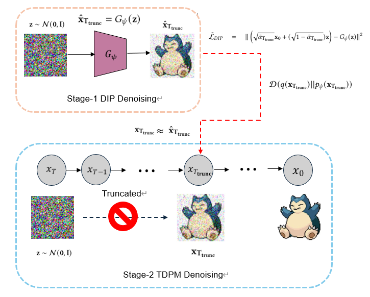

# TDPM-DIP

This repo contains the implementation for [Truncated Diffusion Probabilistic Models with Deep Image Prior framework](report.pdf)

TDPM-DIP is a framework that improves the Denoising Diffusion Probabilistic Models (DDPM) with Deep Image Prior (DIP) as an implicit generator $G_\psi$. TDPM-DIP works on a truncated diffusion chain which has shorter length than DDPM, and the implicit distribution at $T_{trunc}$ will be generated by DIP in order to approximate with the distribution generated by the noise scheduler. An illustrative about TDPM-DIP framework are shown in the figure below:

<p align="center">
  
</p>

## Requirements
- Make sure to install all the dependencies in the requirements.txt
```
pip install -r requirements.txt
```


## Publicly available Dataset
- Pokemon dataset from HugGAN Community
- The dataset can be accessed here: https://huggingface.co/datasets/huggan/pokemon.


## Usage
### 1. Git clone or download the codes.
```
git clone https://github.com/felixchao/Generative-Models-for-Visual-Signals.git
```
### 2. Training a DDPM model

### 3. Training a DIP model (not necessary)

### 4. Training/Sampling a TDPM-DIP model

## Evaluation and Results

## Acknowledgements

This implementation is based on / inspired by:
- [https://github.com/lucidrains/denoising-diffusion-pytorch](https://github.com/lucidrains/denoising-diffusion-pytorch) (the DDPM repo), 
- [https://github.com/DmitryUlyanov/deep-image-prior](https://github.com/DmitryUlyanov/deep-image-prior) (the DIP repo),
- [https://github.com/JegZheng/truncated-diffusion-probabilistic-models](https://github.com/JegZheng/truncated-diffusion-probabilistic-models) (the TDPM repo).
