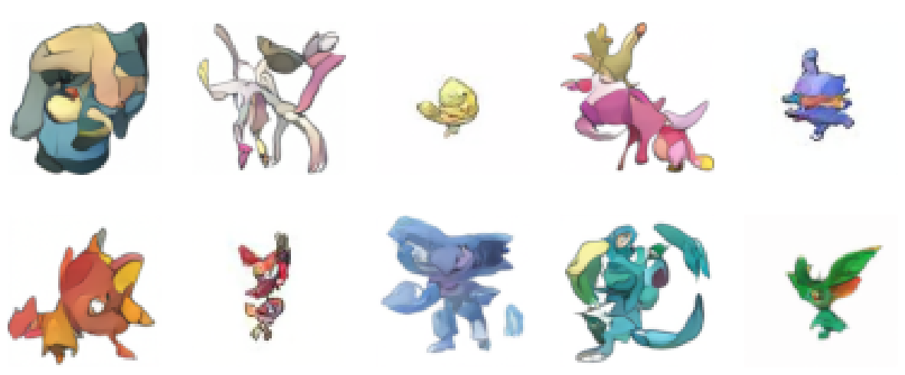

# TDPM-DIP

This repo contains the implementation for [Truncated Diffusion Probabilistic Models with Deep Image Prior framework](report.pdf)

TDPM-DIP is a framework that improves the Denoising Diffusion Probabilistic Models (DDPM) with Deep Image Prior (DIP) as an implicit generator $G_\psi$. TDPM-DIP works on a truncated diffusion chain which has shorter length than DDPM, and the implicit distribution at $T_{trunc}$ will be generated by DIP in order to approximate with the distribution generated by the noise scheduler. An illustrative about TDPM-DIP framework are shown in the figure below:

<p align="center">
  
</p>

In the TDPM-DIP framework, the truncated step $T_{trunc}$ can be adjusted to any number you like. For
the **quick reverse process**, we can select the fewer truncated steps for computational efficiency by accelerating the DDPM reverse process.
On the other hand, for **higher truncated steps**, the generated images can be more creative and interesting due to the high noisy level, and it’s useful for image generation or style translation tasks. 

## Requirements
- Make sure to install all the dependencies in the requirements.txt
```
pip install -r requirements.txt
```


## Publicly available Dataset
- Pokemon dataset from HugGAN Community
- The dataset can be accessed here: https://huggingface.co/datasets/huggan/pokemon.


## Usage
### 1. Git clone or download the codes.
```
git clone https://github.com/felixchao/Generative-Models-for-Visual-Signals.git
```
### 2. Training a DDPM model
- Open the `DDPM.ipynb` Jupyter Notebook.
- Start training DDPM model (U-Net) for your custom dataset by simply replacing `dataset_name`.
- Push your DDPM model to HuggingFace Hub through the below method:
```
model.push_to_hub("your-model-name")
noise_scheduler.push_to_hub("your-noise-scheduler-name")
```
- Inferencing your model through the HuggingFace pipeline:
```
pipeline = DDPMPipeline(unet=model, scheduler=noise_scheduler)
images = pipeline(batch_size = {the-number-of-images}).images
```
- Example:

<p align="center">
  
</p>

### 3. Training a DIP model (not necessary)
This step isn't necessary to do, because the DIP model will always be initialized in the **TDPM-DIP from Step 4**.
- Open the `DIP.ipynb` Jupyter Notebook.
- Start training DIP model (U-Net) from one image.
- You can use `show_images(images)` to inspect the denoising process in DIP.
- Example:

<p align="center">
  
</p>

- You can use `plot_iteration_performance(time_steps, mse_losses, psnr_values, ssim_values)` to inspect the metrics during training.
- Example:

<p align="center">
  
</p>


### 4. Training/Sampling a TDPM-DIP model
- Open the `TDPM-DIP.ipynb` Jupyter Notebook.
- Create TDPM-DIP model and load the pre-trained DDPM that you have trained.
- Start training and execute the algorithm.
- Evaluate TDPM-DIP, DDPM, and DIP on different tasks.

## Evaluation and Results
This report aims to demonstrate that TDPM-DIP can generate high quality faster by using
fewer steps of reverse diffusion. The experiment uses the image dataset of Pokemon to test
the proposed method and compare it with standalone DDPM and DIP methods. There are two
tasks to test the TDPM-DIP method: **Image Generation** and **Image Denoising**.
 
### Image Generation
<div align="center">
  
| Method  | FID  | Reverse Steps |Inference Time|
|:-----:|:------:|:---------------:|:---------------:|
| DDPM | 69.05 |  1000            |38s |
| **TDPM-DIP**  | **20.12** | 110           |7s|

</div>

<p align="center">
  
</p>

### Image Denoising
<div align="center">
  
| Method   | PSNR  | SSIM | Reverse Steps |Inference Time|
|:-----:|:------:|:---------------:|:---------------:|:----:|
| DDPM | 13.40 | 0.369           |600 |32s|
| DIP  | 32.12 | 0.948           |100|7s|
| **TDPM-DIP**  | **32.63** | **0.970**           |110|7s|
  
</div>


<p align="center">
  
</p>

## Acknowledgements

This implementation is based on / inspired by:
- [https://github.com/lucidrains/denoising-diffusion-pytorch](https://github.com/lucidrains/denoising-diffusion-pytorch) (the DDPM repo), 
- [https://github.com/DmitryUlyanov/deep-image-prior](https://github.com/DmitryUlyanov/deep-image-prior) (the DIP repo),
- [https://github.com/JegZheng/truncated-diffusion-probabilistic-models](https://github.com/JegZheng/truncated-diffusion-probabilistic-models) (the TDPM repo).
